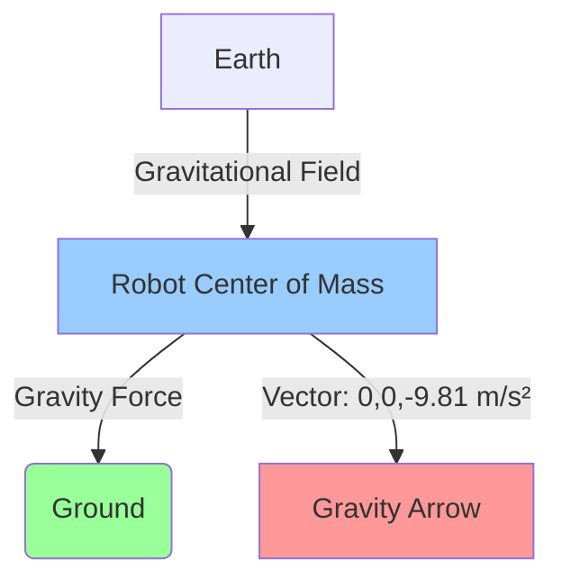
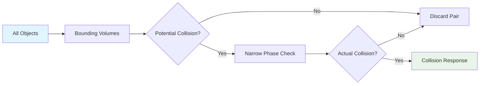
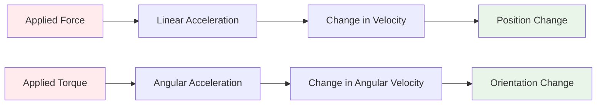
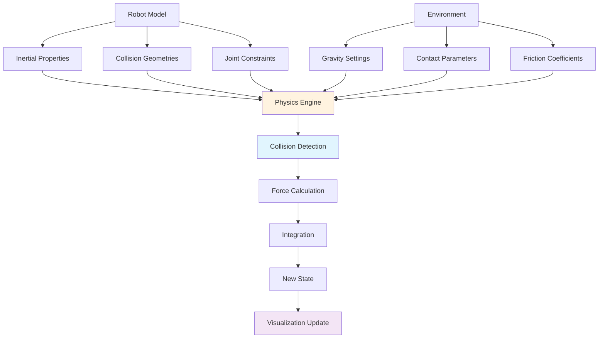
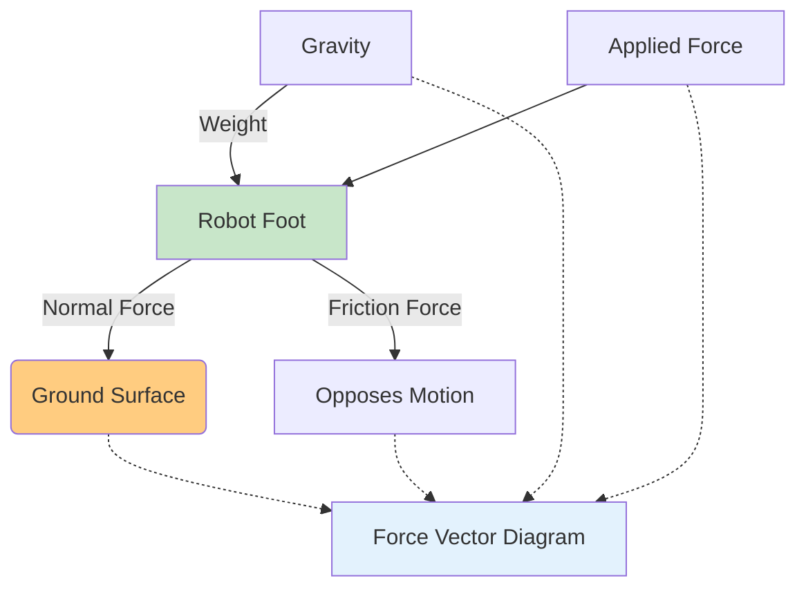
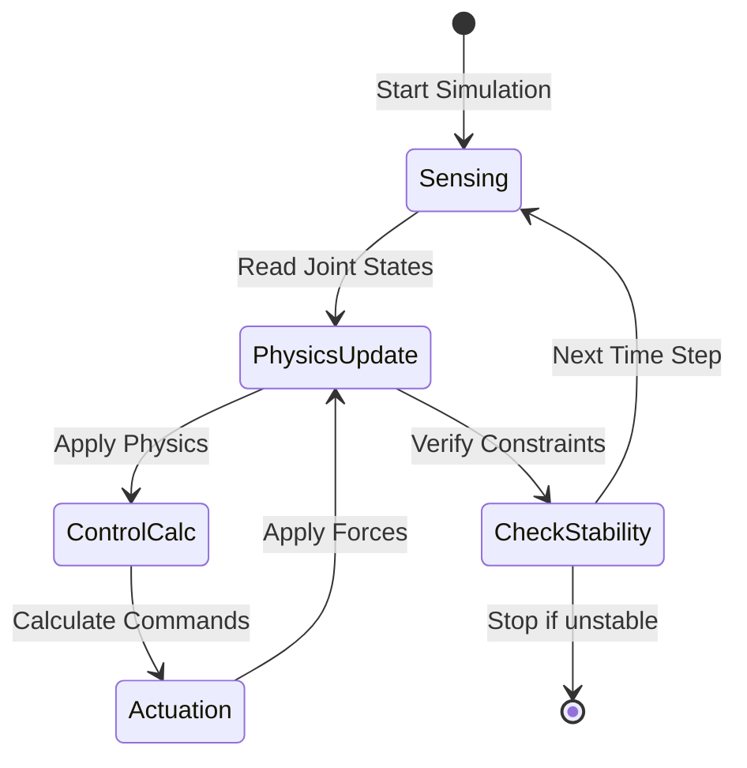

# Physics Concepts Diagrams and Visualizations

This section provides visual representations and diagrams to help understand the physics concepts covered in this chapter.

## Gravity Visualization

### Gravity Vector Representation


### Gravity Effects Comparison
```
Normal Gravity (9.81 m/s²):
Robot falls quickly to ground
Stable standing requires active control

Low Gravity (1.62 m/s²):
Robot falls slowly
Larger movements possible
Less control effort needed

Zero Gravity:
Robot floats freely
Movement requires reaction forces
Balance control not applicable
```

## Collision Detection Visualization

### Broad Phase vs Narrow Phase


### Collision Geometry Types
```
Box Collision:
  _______
 /|     /|
/_|____/ |
| |____|_|
|/_____|/

Sphere Collision:
     *****
   **     **
  *         *
  *   O     *
   **     **
     *****

Cylinder Collision:
   _____
  /     \
 |   O   |
  \_____/
```

## Dynamics Visualization

### Force and Torque Relationships


### Inertial Tensor Visualization
```
3D Inertial Tensor:
┌                ┐
│ Ixx  Ixy  Ixz │
│ Iyx  Iyy  Iyz │
│ Izx  Izy  Izz │
└                ┘

Where:
- Ixx, Iyy, Izz: Moments of inertia (resistance to rotation about axes)
- Ixy, Ixz, Iyz: Products of inertia (coupling between axes)
```

## Physics Simulation Pipeline

### Complete Physics Simulation Flow


## Humanoid Robot Physics Model

### Simplified Humanoid Physics Representation
```
          Torso (Mass: 5kg)
              |
              | Joint (Hip)
              |
    Thigh L        Thigh R
     (2kg)          (2kg)
        |              |
    Joint (Knee)   Joint (Knee)
        |              |
    Shin L (1.5kg)   Shin R (1.5kg)
        |              |
    Foot L (0.5kg)   Foot R (0.5kg)

Gravity: (0, 0, -9.81) m/s²
Center of Mass: Calculated from all link masses and positions
```

## Contact Force Visualization

### Ground Reaction Forces


## Simulation Parameter Relationships

### Time Step vs Accuracy vs Performance
```
High Accuracy (Small Time Step):
┌─────────────────────────────────┐
│ ▓▓  ▓▓  ▓▓  ▓▓  ▓▓  ▓▓  ▓▓  ▓▓ │ ← More computation
│ ▓▓  ▓▓  ▓▓  ▓▓  ▓▓  ▓▓  ▓▓  ▓▓ │ ← More accurate
└─────────────────────────────────┘

Low Accuracy (Large Time Step):
┌─────────────────────────────────┐
│ ▓   ▓   ▓   ▓   ▓   ▓   ▓   ▓  │ ← Less computation
│ ▓   ▓   ▓   ▓   ▓   ▓   ▓   ▓  │ ← Less stable
└─────────────────────────────────┘
```

## Control System Integration

### Physics-Aware Control Loop


## Common Physics Parameters Reference

### Typical Values for Humanoid Robotics
| Parameter | Symbol | Typical Range | Units | Notes |
|-----------|--------|---------------|-------|-------|
| Gravity | g | 9.81 (Earth) | m/s² | Standard value |
| Link Mass | m | 0.1 - 10 | kg | Depends on link size |
| Joint Damping | c | 0.1 - 10 | N·s/m | Reduces oscillation |
| Joint Friction | μ | 0.1 - 1.0 | - | Static/dynamic |
| Restitution | e | 0.0 - 0.5 | - | Bounciness |
| Time Step | Δt | 0.001 - 0.01 | s | Accuracy vs performance |

## Visualization Tips

### Creating Physics Diagrams
1. Use consistent colors for different physics concepts
2. Include coordinate frame indicators (x: red, y: green, z: blue)
3. Show force vectors with arrows and labels
4. Use exploded views for complex assemblies
5. Include scale references where appropriate

### Simulation Visualization
- Color-code different physical properties (velocity, force, contact)
- Use particle effects to show contact points
- Animate force vectors to show magnitude changes
- Overlay physics data on 3D models
- Provide toggle options for different visualization layers