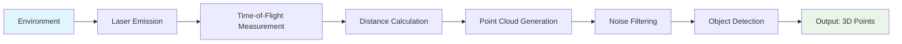
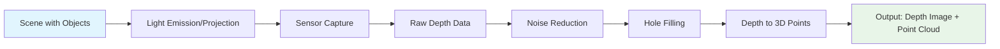
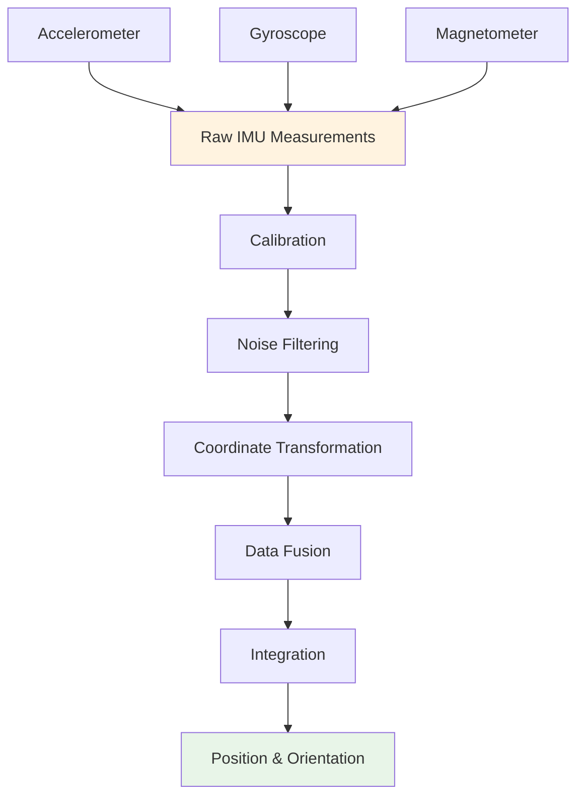
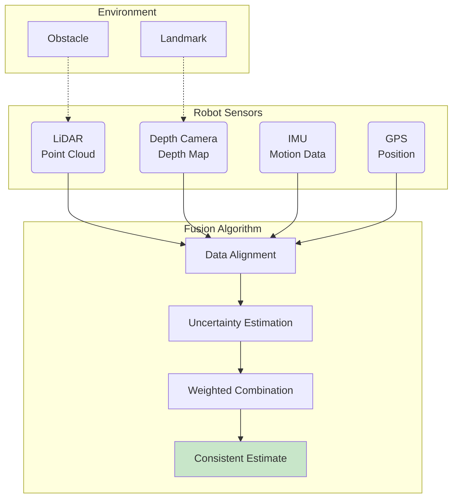
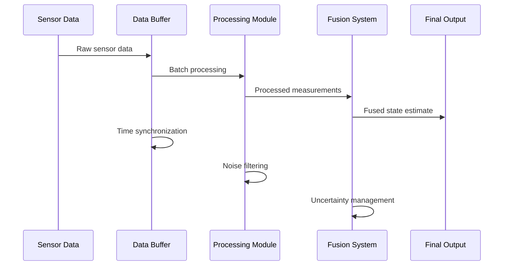
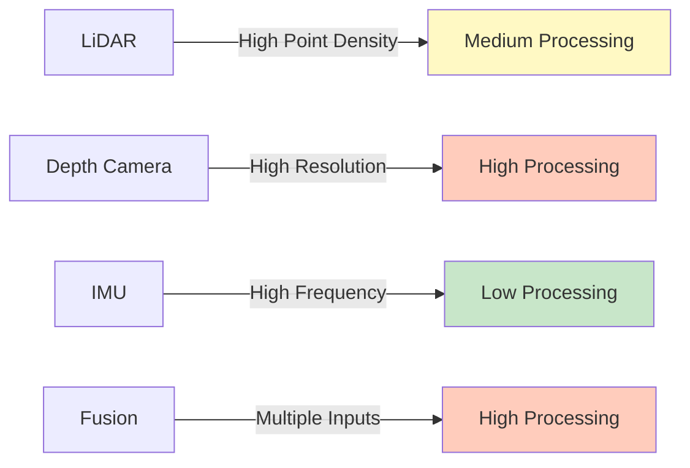
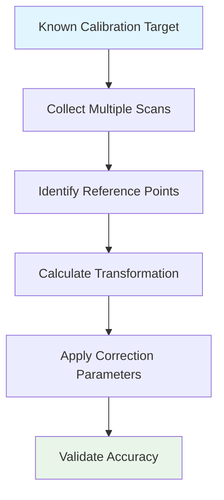
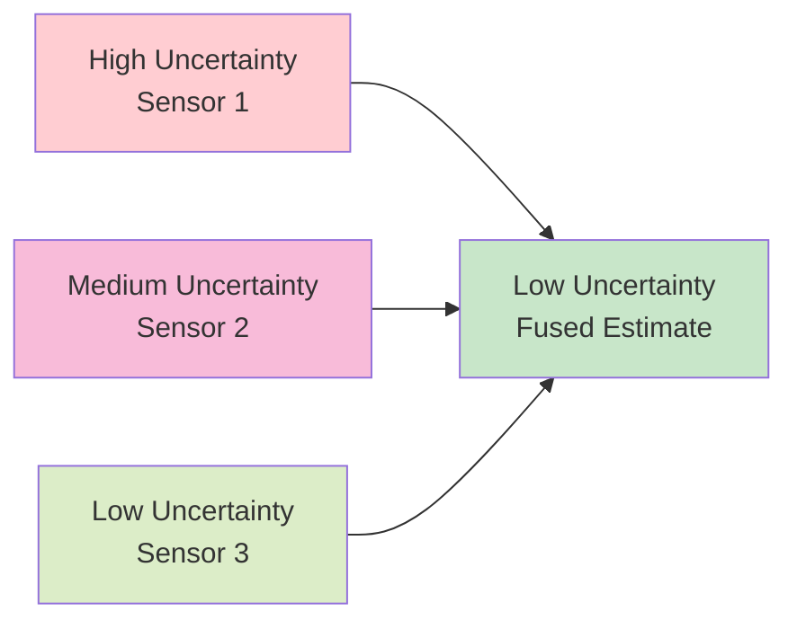
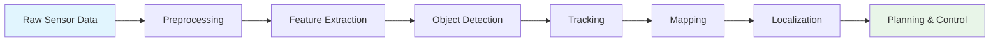

# Sensor Data Outputs and Processing Diagrams

This section describes the diagrams that should illustrate sensor data outputs and processing in robotics applications, along with guidance on how to create them for educational purposes.

## LiDAR Data Visualization Diagrams

### Point Cloud Representation
```
[3D Coordinate System with X, Y, Z axes]
    *
   * *          ← Point cloud from LiDAR scan
  *   *
 *     *
*       *
  Robot ┘

Front View: Dense points forming environmental structure
Side View: Cross-section showing distance measurements
Top View: 2D projection showing planar mapping
```

**Diagram Description**: This diagram shows how LiDAR creates a point cloud by measuring distances to objects in the environment. The robot (represented as a box) emits laser beams in multiple directions, creating a 3D representation of surrounding objects.

### LiDAR Processing Pipeline


**Diagram Description**: This flowchart shows the complete LiDAR processing pipeline from laser emission to final point cloud output, highlighting the various processing steps involved.

## Depth Camera Data Visualization

### Depth Image Formation
```
[Camera View]                    [Depth Map]
┌─────────────┐    Light       ┌─────────────┐
│  ████████   │   Sources  →   │  1 1 1 1 1  │ ← Close objects (white)
│  ██   ██    │                │  2 2 2 2 2  │
│  ██   ██    │                │  3 3 3 3 3  │ ← Medium distance (gray)
│  ████████   │                │  4 4 4 4 4  │
│     ▲       │                │  5 5 5 5 5  │ ← Far objects (black)
└─────────────┘                └─────────────┘
      │                              │
      └─ RGB Image ──────────────────┘
```

**Diagram Description**: This diagram shows how a depth camera captures both color and depth information simultaneously, with the depth map showing distance values for each pixel.

### Depth Camera Processing Pipeline


## IMU Data Visualization

### IMU Sensor Components
```
[3D Cube representing IMU sensor]
     Z
     │  / Y
     │ /
     └───── X

Accelerometer: Measures forces along X, Y, Z axes
Gyroscope: Measures rotation rates around X, Y, Z axes
Magnetometer: Measures magnetic field along X, Y, Z axes
```

**Diagram Description**: This diagram shows the three-dimensional coordinate system of an IMU and the different measurements each component provides.

### IMU Data Processing and Integration


## Sensor Fusion Visualization

### Multi-Sensor Data Integration


**Diagram Description**: This diagram shows how multiple sensors contribute data to a fusion algorithm that produces a consistent estimate of the environment and robot state.

### Kalman Filter Visualization
```
Time →
Initial State [P₀] → [Prediction] → [Update] → [P₁] → [Prediction] → [Update] → [P₂]
    ↑              ↑              ↑              ↑              ↑              ↑
   [x₀]          [x̂₁|₀]        [x̂₁]          [x̂₂|₁]        [x̂₂]          [x̂₃]

Where: P = Uncertainty/Covariance, x̂ = State Estimate
```

**Diagram Description**: This timeline diagram shows the prediction-update cycle of a Kalman filter, illustrating how uncertainty changes over time.

## Data Processing Workflows

### Real-Time Sensor Processing


### Sensor Data Formats
```
LiDAR Point Cloud Format:
┌─────────────────────────────────────────┐
│ Point 1: [X₁, Y₁, Z₁, Intensity₁]      │
│ Point 2: [X₂, Y₂, Z₂, Intensity₂]      │
│ Point 3: [X₃, Y₃, Z₃, Intensity₃]      │
│ ...                                     │
│ Point N: [Xₙ, Yₙ, Zₙ, Intensityₙ]      │
└─────────────────────────────────────────┘

Depth Camera Format:
┌─────────────────────────┐
│ [D₁₁ D₁₂ D₁₃ ... D₁w]  │ ← Row 1 depth values
│ [D₂₁ D₂₂ D₂₃ ... D₂w]  │ ← Row 2 depth values
│ [...]                   │ ← ... more rows
│ [Dh₁ Dh₂ Dh₃ ... Dhw]  │ ← Row h depth values
└─────────────────────────┘

IMU Data Format:
┌─────────────────────────────────────────┐
│ Time | Accel_X | Accel_Y | Accel_Z |   │
│      | Gyro_X  | Gyro_Y  | Gyro_Z  |   │
│      | Mag_X   | Mag_Y   | Mag_Z   |   │
└─────────────────────────────────────────┘
```

## Performance Analysis Diagrams

### Sensor Accuracy vs. Range
```
Accuracy (cm)
    │
  10│     ○ LiDAR
    │    ○
  5 │        ○
    │          ○ Depth Camera
  0 │            ○
    └─────────────────── Range (m)
    0   5   10  15  20  25  30
```

**Diagram Description**: This graph compares the accuracy of different sensors across various ranges, showing where each technology excels.

### Processing Load Comparison


## Sensor Calibration Diagrams

### LiDAR Calibration Process


### Multi-Sensor Calibration
```
[Robot Platform]
├── LiDAR Mount Point (x₁, y₁, z₁, roll₁, pitch₁, yaw₁)
├── Camera Mount Point (x₂, y₂, z₂, roll₂, pitch₂, yaw₂)
├── IMU Mount Point (x₃, y₃, z₃, roll₃, pitch₃, yaw₃)
└── Base Coordinate Frame

Transformation matrices define relationships between sensors
```

## Error Analysis and Uncertainty Visualization

### Sensor Uncertainty Representation
```
Measurement: 2.5m ± 0.1m
Distribution: Normal distribution around true value
Confidence: 68% within ±0.1m, 95% within ±0.2m

[True Value] ←─ 2.5m ─→ [Measurement]
     │                    │
     └─ ← 0.1m → ────────┘
```

### Fusion Uncertainty Reduction


## Integration Examples

### Robot Perception Pipeline


These diagrams and visualizations should be created using appropriate tools like:
- Vector graphics software (Inkscape, Adobe Illustrator) for technical diagrams
- Charting tools (Matplotlib, D3.js) for data plots
- 3D visualization software (Blender) for spatial representations
- Diagramming tools (Mermaid, Draw.io) for process flows

The visualizations help students understand complex sensor concepts by providing concrete, visual representations of abstract processes and data flows.