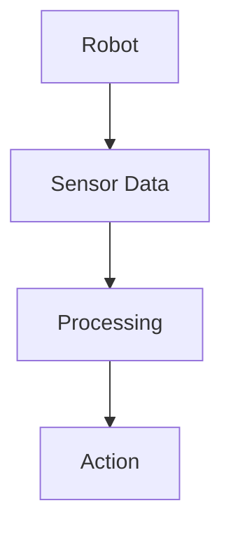

# Technical Formatting Guide: Digital Twin Simulation Module

This document establishes consistent formatting and presentation for technical concepts throughout the Digital Twin Simulation module.

## Mathematical Notation

### Inline Equations
Use single dollar signs for inline equations: `F = ma`

### Display Equations
Use code blocks for complex equations:

```
v = ds/dt
a = dv/dt = d²s/dt²
```

## Technical Diagrams

Where appropriate, include diagrams to illustrate concepts. Use the following format:



## Key Technical Concepts

### Physics Simulation
- **Gravity**: The constant downward acceleration applied to objects
- **Collision**: The interaction between two or more objects when they come into contact
- **Dynamics**: The study of forces and torques and their effect on motion

### Environment Simulation
- **Rendering**: The process of generating an image from a model by means of computer software
- **Lighting**: The simulation of light sources and their interaction with objects
- **Textures**: Surface detail applied to 3D models to enhance visual realism

### Sensor Simulation
- **Point Cloud**: A set of data points in space, representing the external surface of an object
- **Depth Map**: A type of image where each pixel value represents the distance from the sensor
- **Inertial Data**: Measurements of acceleration and angular velocity from IMU sensors

## Notation Conventions

### Vectors and Matrices
- Vectors: `v⃗`, `**v**`, or `v`
- Matrices: `**R**`, `**T**`

### Coordinate Systems
- World frame: `W`
- Robot frame: `R`
- Sensor frame: `S`

### Units
- Distances: meters (m)
- Angles: radians (rad) or degrees (°)
- Time: seconds (s)
- Forces: Newtons (N)