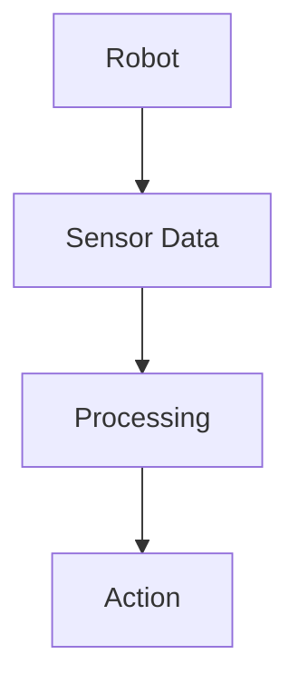

# Technical Concepts and Formatting Guide

This document establishes consistent formatting and presentation for technical concepts throughout the Digital Twin Simulation module.

## Code Examples

### Inline Code
Use backticks for inline code references: `gazebo`, `ros2 run`, `Unity3D`

### Code Blocks
Use triple backticks with language specification:

```xml
<robot name="my_robot">
  <link name="base_link">
    <visual>
      <geometry>
        <box size="1 1 1"/>
      </geometry>
    </visual>
  </link>
</robot>
```

### Command Line Examples
Format terminal commands with the `$` prompt:

```bash
$ ros2 launch my_robot simulation.launch.py
$ gazebo --verbose my_world.world
```

## Mathematical Notation

### Inline Equations
Use single dollar signs for inline equations: $F = ma$

### Display Equations
Use double dollar signs for display equations:

$$v = \frac{ds}{dt}$$

$$a = \frac{dv}{dt} = \frac{d^2s}{dt^2}$$

## Technical Diagrams

Where appropriate, include diagrams to illustrate concepts. Use the following format:



## Key Technical Concepts

### Physics Simulation
- **Gravity**: The constant downward acceleration applied to objects
- **Collision**: The interaction between two or more objects when they come into contact
- **Dynamics**: The study of forces and torques and their effect on motion

### Environment Simulation
- **Rendering**: The process of generating an image from a model by means of computer software
- **Lighting**: The simulation of light sources and their interaction with objects
- **Textures**: Surface detail applied to 3D models to enhance visual realism

### Sensor Simulation
- **Point Cloud**: A set of data points in space, representing the external surface of an object
- **Depth Map**: A type of image where each pixel value represents the distance from the sensor
- **Inertial Data**: Measurements of acceleration and angular velocity from IMU sensors

## Notation Conventions

### Vectors and Matrices
- Vectors: $\vec{v}$, $\mathbf{v}$, or $v$
- Matrices: $\mathbf{R}$, $\mathbf{T}$

### Coordinate Systems
- World frame: $W$
- Robot frame: $R$
- Sensor frame: $S$

### Units
- Distances: meters (m)
- Angles: radians (rad) or degrees (°)
- Time: seconds (s)
- Forces: Newtons (N)

## Warning and Note Boxes

Use these for important information:

:::note
This is a note box for important information that supplements the main content.
:::

:::tip
This is a tip box for helpful suggestions or best practices.
:::

:::caution
This is a caution box for warnings about potential issues or problems.
:::

:::danger
This is a danger box for critical warnings about serious problems.
:::