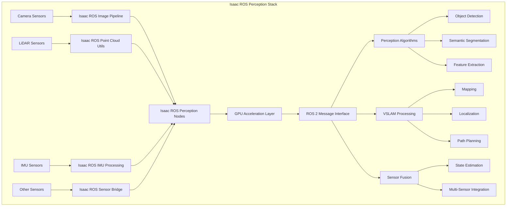
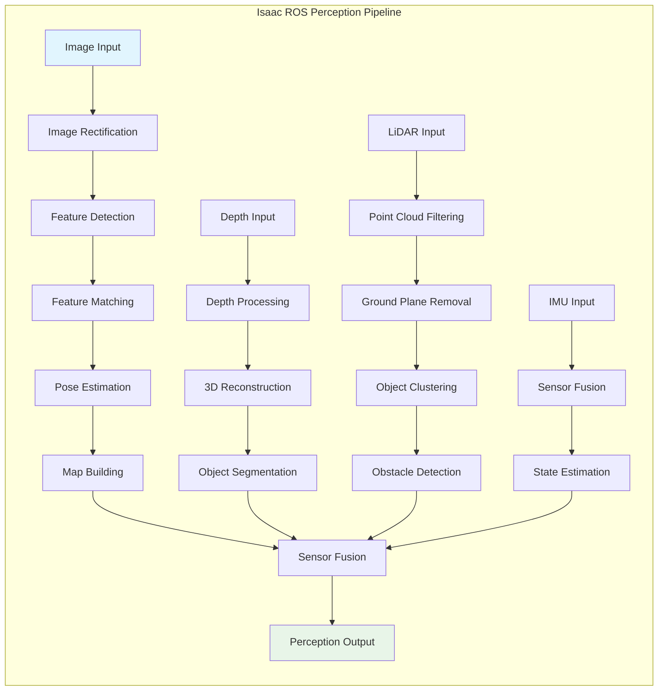
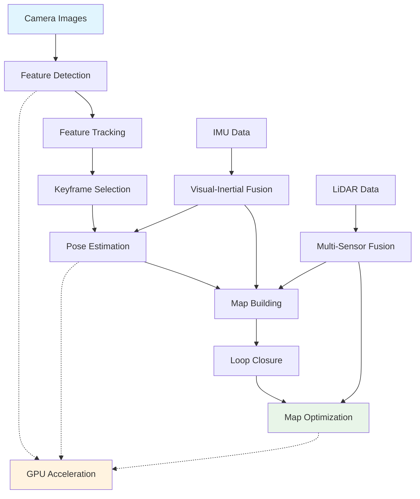
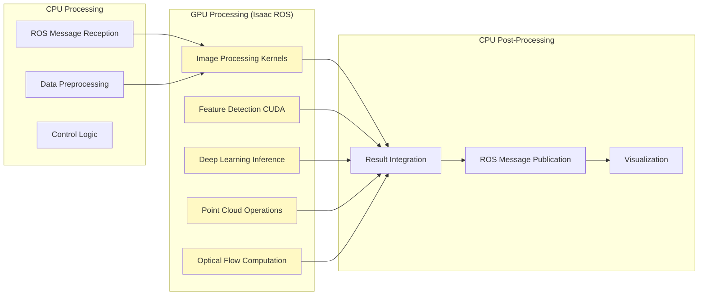
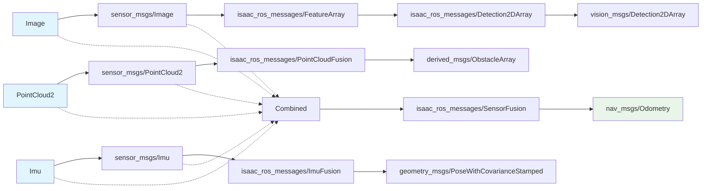
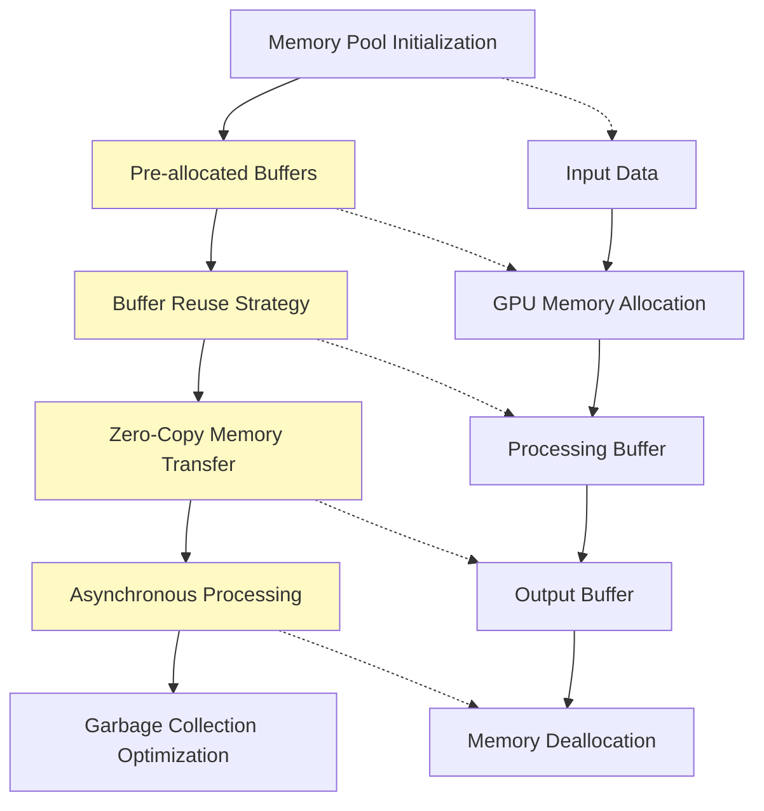
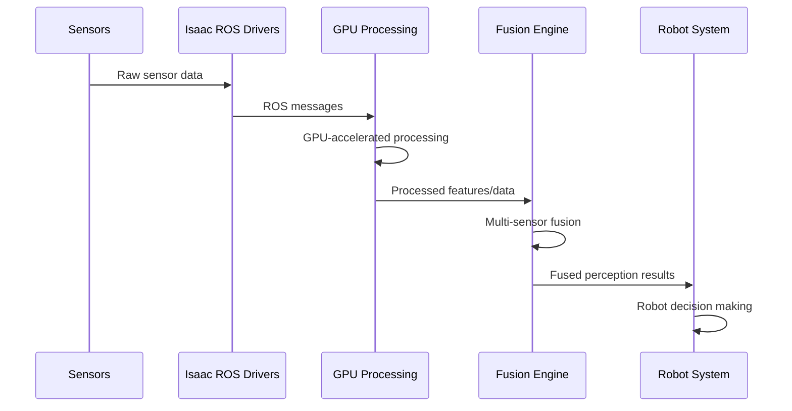
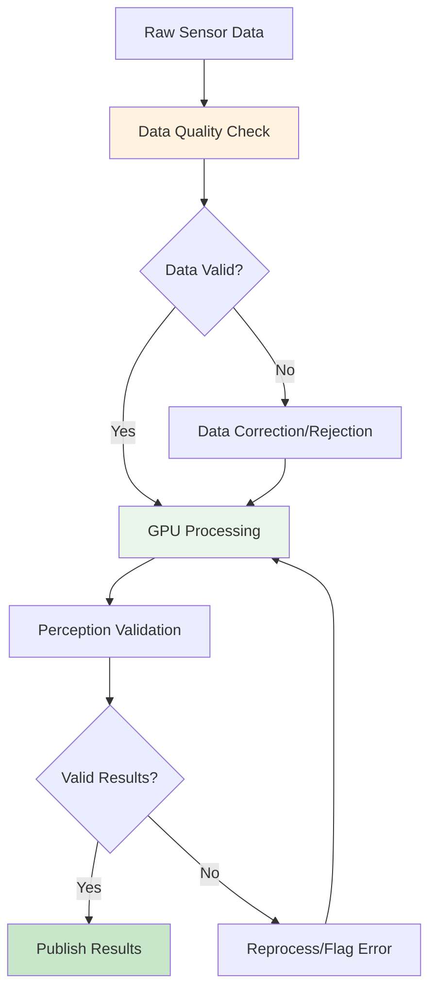
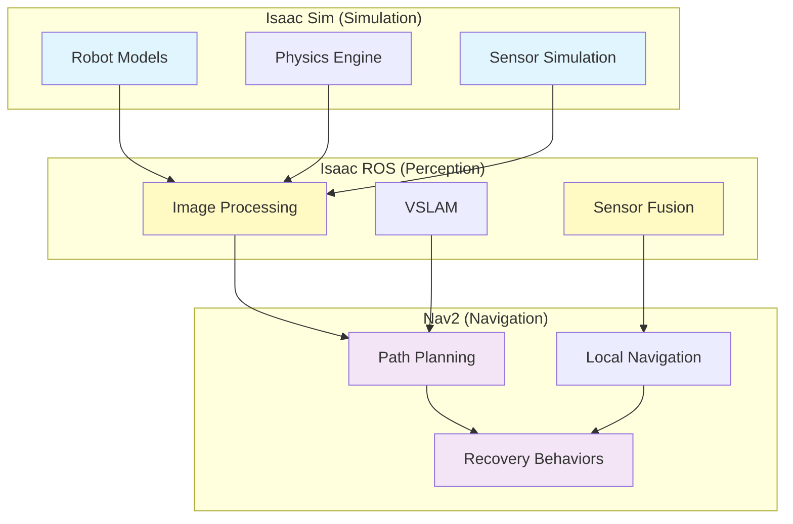

# Diagrams and Visualizations: Isaac ROS Concepts

This section provides diagrams and visualizations to help understand Isaac ROS perception and sensor processing concepts, including pipeline architectures, data flows, and processing workflows.

## Isaac ROS Architecture Overview

### Isaac ROS Package Structure


### Isaac ROS Processing Pipeline
```
Raw Sensor Data
       ↓
Isaac ROS Drivers
       ↓
GPU-Accelerated Processing
       ↓
    ↓
Perception Algorithms
       ↓
Fused Sensor Data
       ↓
Robot Control System
```

## Perception Pipeline Visualization

### Isaac ROS Perception Components


### Feature Detection and Matching Flow
```
Input Image → Feature Detection → Descriptor Extraction → Feature Matching → Pose Estimation
     ↑              ↑                    ↑                    ↑               ↑
  (Camera)    (FAST/CORNER)       (ORB/SIFT)         (FLANN/BF)    (PnP/RANSAC)
```

## VSLAM Process Visualization

### Visual SLAM Architecture


### Stereo VSLAM Pipeline
```
Left Camera ──┐
              ├──→ Stereo Matching ──→ 3D Point Cloud
Right Camera ──┘
     ↓
Rectification → Feature Extraction → Stereo Fusion → Pose Estimation
     ↓              ↓                    ↓               ↓
Camera Matrix   Keypoint Descriptors  3D Coordinates  Robot Position
```

## Sensor Fusion Visualization

### Multi-Sensor Data Integration
```mermaid
graph LR
    subgraph "Sensor Inputs"
        A[Camera - RGB Data]
        B[LiDAR - Point Cloud]
        C[IMU - Acceleration/Orientation]
        D[GPS - Position (if available)]
    end

    subgraph "Isaac ROS Fusion Layer"
        E[Temporal Synchronization]
        F[Spatial Registration]
        G[Data Association]
        H[State Estimation]
    end

    subgraph "Fused Output"
        I[Unified Perception State]
        J[Environmental Map]
        K[Robot Trajectory]
    end

    A --> E
    B --> E
    C --> E
    D --> E

    E --> F
    F --> G
    G --> H

    H --> I
    H --> J
    H --> K

    style A fill:#e3f2fd
    style B fill:#e3f2fd
    style C fill:#e3f2fd
    style D fill:#e3f2fd
    style I fill:#e8f5e8
    style J fill:#e8f5e8
    style K fill:#e8f5e8
```

### Kalman Filter for Sensor Fusion
```
┌─────────────────┐    ┌─────────────────┐    ┌─────────────────┐
│   Prediction    │    │   Correction    │    │  State Update   │
│   (IMU Data)    │───▶│ (Sensor Data)   │───▶│   (Fused State) │
│                 │    │                 │    │                 │
│ x(k|k-1) = F*x  │    │ Innovation:     │    │ x(k|k) = x(k|k-1)│
│ P(k|k-1) = F*P*F^T + Q │ y = z - H*x(k|k-1) │ + K*(z - H*x(k|k-1))│
│                 │    │ Gain: K = P*H^T*S^-1 │ P(k|k) = (I - K*H)*P(k|k-1)│
└─────────────────┘    │ S = H*P*H^T + R │    └─────────────────┘
                       └─────────────────┘
```

## GPU Acceleration Visualization

### Isaac ROS GPU Pipeline


### CUDA Memory Management
```
Host Memory (CPU) ↔ CUDA Memory Pool ↔ Device Memory (GPU)
       ↓                ↓                   ↓
   Input Data    ←→  Unified Memory   ←→ Accelerated Processing
       ↑                ↑                   ↑
   (Sensor Data)    (Isaac ROS)        (Perception Results)
```

## Isaac ROS Message Types Visualization

### Perception Message Flow


## Performance Optimization Visualization

### Isaac ROS Optimization Layers
```
┌─────────────────────────────────────────────────────────────┐
│                    Application Layer                        │
│  Perception Algorithms, VSLAM, Sensor Fusion                │
├─────────────────────────────────────────────────────────────┤
│                   Isaac ROS Layer                           │
│  GPU Acceleration, CUDA Kernels, TensorRT Inference         │
├─────────────────────────────────────────────────────────────┤
│                   Hardware Layer                            │
│  NVIDIA GPU, CUDA Cores, Tensor Cores, Memory Bandwidth     │
└─────────────────────────────────────────────────────────────┘
```

### Memory Optimization Strategy


## Isaac ROS Workflow Diagrams

### Complete Perception Workflow


### Real-time Processing Pipeline
```
┌─────────────────┐    ┌─────────────────┐    ┌─────────────────┐
│  Frame N-1      │    │  Frame N        │    │  Frame N+1      │
│  Processing     │───▶│  Processing     │───▶│  Processing     │
│  (Complete)     │    │  (In Progress)  │    │  (Queued)       │
└─────────────────┘    └─────────────────┘    └─────────────────┘
         │                       │                       │
         ▼                       ▼                       ▼
   Perception ←────────── Perception ←────────── Perception
   Results                 Results              Results
   Published             Published            Published
```

## Quality Assurance Visualization

### Isaac ROS Data Validation Pipeline


## Troubleshooting Visualization

### Isaac ROS Performance Diagnostic Tree
```
Performance Issues
        │
        ├── GPU Utilization Low
        │   ├── Kernel Launch Overhead
        │   ├── Memory Transfer Bottleneck
        │   └── Small Batch Sizes
        │
        ├── GPU Utilization High
        │   ├── Thermal Throttling
        │   ├── Memory Starvation
        │   └── Compute Bound
        │
        ├── Memory Issues
        │   ├── GPU Memory Exhaustion
        │   ├── Memory Fragmentation
        │   └── Host/Device Mismatch
        │
        └── Synchronization Issues
            ├── Sensor Timing
            ├── Message Queuing
            └── Pipeline Stalls
```

## Isaac ROS Integration Visualization

### Integration with Isaac Sim and Nav2


These diagrams and visualizations help illustrate the key concepts in Isaac ROS perception and sensor processing, including the architecture, data flows, processing pipelines, and integration with other robotics systems. They provide visual representations of complex concepts like GPU acceleration, sensor fusion, and real-time processing workflows that are essential for understanding Isaac ROS in robotics applications.