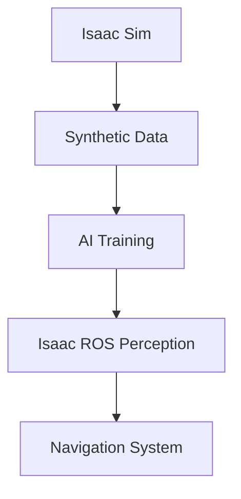

# Technical Concepts and Formatting Guide: Isaac Module

This document establishes consistent formatting and presentation for technical concepts throughout the NVIDIA Isaac module.

## Code Examples

### Inline Code
Use backticks for inline code references: `isaac_ros`, `nvblox`, `isaac_sim`, `nav2_bringup`

### Code Blocks
Use triple backticks with language specification:

```xml
<launch>
  <node pkg="isaac_ros_pointcloud_utils" exec="flatness_check_node" name="flatness_check_node">
    <param name="grid_size_x" value="20"/>
    <param name="grid_size_y" value="20"/>
  </node>
</launch>
```

### Command Line Examples
Format terminal commands with the `$` prompt:

```bash
$ roslaunch isaac_sim bringup.launch
$ ros2 launch nav2_bringup navigation_launch.py
```

## Mathematical Notation

### Inline Equations
Use backticks for inline equations: `P = R^T(P' - t)`

### Display Equations
Use code blocks for complex equations:

```
v = ds/dt
SE(3) = [R t; 0^T 1]
```

## Technical Diagrams

Where appropriate, include diagrams to illustrate concepts. Use the following format:



## Key Technical Concepts

### Isaac Sim
- **USD**: Universal Scene Description format used by Isaac Sim
- **PhysX**: NVIDIA's physics engine for realistic simulation
- **RTX**: Ray tracing technology for photorealistic rendering
- **Omniverse**: Underlying platform for Isaac Sim

### Isaac ROS
- **ROS 2**: Robot Operating System version 2 for communication
- **CUDA**: NVIDIA's parallel computing platform for acceleration
- **TensorRT**: NVIDIA's inference optimizer for deep learning
- **Perception Nodes**: Accelerated processing pipelines

### Nav2
- **Costmaps**: 2D grids representing obstacle costs
- **Path Planner**: Algorithm for computing collision-free paths
- **Controller**: Algorithm for following planned paths
- **Recovery Behaviors**: Actions when navigation fails

## Notation Conventions

### Vectors and Matrices
- Vectors: `v⃗`, `**v**`, or `v`
- Matrices: `**R**`, `**T**`

### Coordinate Systems
- **World Frame**: `W`
- **Robot Frame**: `R`
- **Camera Frame**: `C`
- **Sensor Frame**: `S`

### Units
- Distances: meters (m)
- Angles: radians (rad) or degrees (°)
- Time: seconds (s)
- Frequencies: Hertz (Hz)

## Warning and Note Boxes

Use these for important information:

:::note
This is a note box for important information that supplements the main content.
:::

:::tip
This is a tip box for helpful suggestions or best practices.
:::

:::caution
This is a caution box for warnings about potential issues or problems.
:::

:::danger
This is a danger box for critical warnings about serious problems.
:::

## Isaac-Specific Formatting

### Isaac Sim Components
- **Assets**: `Isaac/Robots/Husky`
- **Scenes**: `Isaac/Environments/SimpleRoom`
- **Actors**: `BaseRigidBody`, `Camera`, `Light`

### Isaac ROS Packages
- **Perception**: `isaac_ros_detect_net`, `isaac_ros_pointcloud_utils`
- **SLAM**: `isaac_ros_vslam`, `nvblox`
- **Navigation**: `isaac_ros_goal_pose_generator`

### Common Isaac Commands
- **Simulation Launch**: `roslaunch isaac_sim_apps simulator.launch`
- **ROS Bridge**: `rosrun isaac_ros_bridge isaac_ros_bridge`
- **Package Installation**: `apt-get install ros-humble-isaac-ros-*`

## Isaac Sim Configuration Files

### URDF/XACRO Format
```xml
<robot name="my_robot">
  <link name="base_link">
    <visual>
      <geometry>
        <mesh filename="package://my_robot/meshes/base.stl"/>
      </geometry>
    </visual>
  </link>
</robot>
```

### Isaac Sim JSON Configuration
```json
{
  "scene": {
    "name": "simple_room",
    "objects": [
      {
        "name": "table",
        "type": "StaticCollider",
        "position": [1.0, 0.0, 0.0]
      }
    ]
  }
}
```

## Isaac ROS Message Types

### Common Message Formats
- **Images**: `sensor_msgs/Image`
- **Point Clouds**: `sensor_msgs/PointCloud2`
- **Odometry**: `nav_msgs/Odometry`
- **TF**: `tf2_msgs/TFMessage`

This formatting guide ensures consistent presentation of NVIDIA Isaac technologies throughout the educational content.